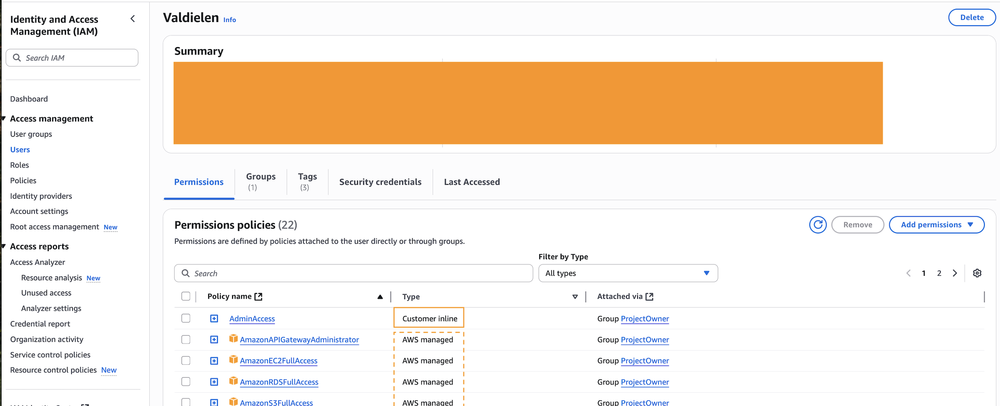

- [English](module01.md)
- [Português](module01.pt.md)

## How to understand the cloud structure?

Before AWS, maintaining a system in production required:

- Investment in physical servers, energy, and space;
- Specialized maintenance staff;
- Fixed costs, even without full utilization;
- Limited scalability (depended on further investment).

The idea of the cloud is abstract, but it is physically built through physical data centers spread across the world and aggregated by regions. To illustrate, let's take South America:

- **Region:** South America.
- **Availability Zone - AZs:** used to host computing resources (EC2, database, etc.) and ensure availability and redundancy. There are 3 AZs under this region in São Paulo;
    * Note: an AZ probably has 2 or more connected data centers.

- **Edge location:** smaller data centers that are used to **replicate content** and **reduce latency**, providing data more quickly to customers through the **Amazon CloudFront** (Content Delivery Network – CDN) service, for example. Both Edge Locations and AZs are part of AWS's global infrastructure, but Edge Locations are especially accessible for companies that want to deliver content (such as streaming) efficiently in regions such as South America, even if the main processing is in another region.

    To learn more, see [AWS Global Infrastructure](https://aws.amazon.com/about-aws/global-infrastructure/).

Today, AWS offers physical and global infrastructure in seconds, and you just use the services. Here we come across a very important and initial concept about AWS: the separation of responsibility between AWS and the customer.

## Shared Responsibility Model

- **Security of the Cloud:** AWS is responsible for the security **OF** the physical infrastructure (data centers, hardware, networks).
- **Security in the Cloud:** the customer is responsible for security **WITHIN** the cloud. This includes protecting access credentials, keeping operating systems and software up to date, and maintaining best practices in the use of services. If there is a password leak or a failure due to lack of updating, the responsibility lies with the customer.

## Cloud Service Models: IaaS, PaaS, and SaaS

In AWS (and other clouds), there are different service models:

- **IaaS (Infrastructure as a Service):** you manage servers, storage, and networks, while AWS takes care of the physical infrastructure. Example: EC2;
- **PaaS (Platform as a Service):** you only manage the applications, while AWS manages the operating system, middleware, and infrastructure. Example: Elastic Beanstalk;
- **SaaS (Software as a Service):** you only use the software, without worrying about infrastructure or platform. Example: any service where you just create an account and use it; Netflix, Gmail, GitHub.

Each model presents a different degree of responsibility between the customer and AWS. For more details on how these responsibilities are distributed in each model, see the [Shared Responsibility Model](https://docs.aws.amazon.com/prescriptive-guidance/latest/strategy-accelerating-security-maturity/understanding-the-security-scope.html).

## Getting started on the AWS platform

### 1. Login and Security (Identity and Access Management - IAM)

- Avoid using the root account on a daily basis;
- Create users with the principle of least privilege (grant only the necessary permissions) and organize them into groups;
- Manage permissions via policies — they can be managed or customized;
- Enable MFA (extra layer of security).

Here we see permissions that have been passed to the user through the ProjectOwner group. Note that there are both AWS and customized policies:




### 2. Spending control and alerts

- **AWS Free Tier:** AWS offers a free tier with monthly limits for many services for a certain period of time. Be careful not to exceed these limits.

> It is the **customer's responsibility** to monitor changes to the service. Recently, in July 2025, AWS changed some policies regarding the [Free Tier](https://aws.amazon.com/pt/free/terms/). From that date on, if you create an account via IAM Identity Center, you will be directed to Organizations, which, by definition, is for companies with a paid account model—the side effect is the loss of the benefits of the free tier. To use the individual account and enjoy the benefits of the Free Tier, you must create the user via the common IAM.

- **Billing Dashboard:** In the AWS Console, access the Billing Dashboard to view current spending, billing history, and details by service.

- **Budgets:** You can create budget alerts to be notified by email when you reach a certain spending amount.

- **Cost Explorer:** Visual tool to analyze and understand where the main costs are.

- **Usage alerts:** Set up alerts to be notified when you are close to reaching the Free Tier limit or a defined budget.

- **Tip:** Always terminate resources you are not using, such as EC2 instances, EBS volumes, and S3 buckets, to avoid unnecessary charges.

### 3. Ways to access AWS services: Console, AWS CLI, and CloudShell

- **Console:** accessed through a browser. More intuitive, ideal for beginners or specific tasks.
- **CLI (Command Line Interface):** command line interface, ideal for automation, scripts, and greater control of services. Requires initial credential configuration, but is most commonly used in development.

**Basic examples (AWS CLI):**

```bash
# Configure credentials - allows me to interact with AWS public endpoints. You need to generate an access key for the user via IAM and enter it in the corresponding fields after running the command below:
aws configure

# Once configured, you can view resources in use:
# List S3 buckets
aws s3 ls

# Describe EC2 instances
aws ec2 describe-instances
```

- **CloudShell:** environment within AWS. I cannot run local scripts, for example, but I can view account and service information.

