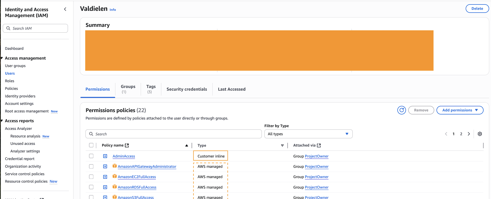

## Como entender a estrutura da nuvem?

Antes da AWS, manter um sistema em produção exigia:

- Investimento em servidores físicos, energia e espaço;
- Equipe especializada para manutenção;
- Custos fixos, mesmo sem uso total;
- Escalabilidade limitada (dependia de mais investimento).

A ideia de nuvem é abstrata, mas construída fisicamente por meio de datacenters físicos espalhados pelo mundo e agregados por regiões. Para exemplificar, peguemos a América do Sul:

- **Region:** América do Sul.
- **Availability Zone - AZs:** são usadas para hospedar recursos computacionais (EC2, banco de dados, etc.) e garantir disponibilidade e redundância. Existem 3 AZs sob essa região em São Paulo;
    * Nota: uma AZ tem provavelmente 2 ou mais datacenters conectados.

- **Edge location:** datacenters menores que são usados para **replicar conteúdo** e **reduzir latência**, fornecendo dados mais rapidamente para os clientes através do serviço **Amazon CloudFront** (Content Delivery Network – CDN), por exemplo. Tanto as Edge Locations quanto as AZs fazem parte da infraestrutura global da AWS, mas as Edge Locations são especialmente acessíveis para empresas que desejam entregar conteúdo (como streaming) de forma eficiente em regiões como a América do Sul, mesmo que o processamento principal esteja em outra região.

    Para saber mais, consulte a [Infraestrutura global da AWS](https://aws.amazon.com/about-aws/global-infrastructure/).

Hoje, o que a AWS oferece é a infraestrutura física e global em segundos, e você apenas utiliza os serviços. Aqui já esbarramos em um conceito muito importante e inicial sobre a AWS: a separação de responsabilidade entre a AWS e o cliente.

## Modelo de responsabilidade compartilhada

- **Security of the Cloud:** AWS é responsável pela segurança **DA** estrutura física (datacenters, hardware, redes).
- **Security in the Cloud:** o cliente é responsável pela segurança **DENTRO** da nuvem. Isso inclui proteger as credenciais de acesso, manter sistemas operacionais e softwares atualizados e manter boas práticas no uso dos serviços. Se houver um vazamento de senha ou uma falha por falta de atualização, a responsabilidade é do cliente.

## Modelos de Serviço em Nuvem: IaaS, PaaS e SaaS

Na AWS (e em outras nuvens), existem diferentes modelos de serviço:

- **IaaS (Infrastructure as a Service):** você gerencia servidores, armazenamento e redes, enquanto a AWS cuida da infraestrutura física. Ex: EC2;
- **PaaS (Platform as a Service):** você gerencia apenas as aplicações, enquanto a AWS gerencia o sistema operacional, middleware e infraestrutura. Ex: Elastic Beanstalk;
- **SaaS (Software as a Service):** você apenas usa o software, sem se preocupar com infraestrutura ou plataforma. Ex: qualquer serviço onde você só faz a conta e usa; Netflix, Gmail, GitHub.

Cada modelo apresenta um grau distinto de responsabilidade entre o cliente e a AWS. Para mais detalhes de como essas responsabilidades se distribuem em cada modelo, consulte o [Modelo de Responsabilidade Compartilhada](https://docs.aws.amazon.com/prescriptive-guidance/latest/strategy-accelerating-security-maturity/understanding-the-security-scope.html).

## Primeiros passos na plataforma AWS

### 1. Login e Segurança (Identity and Access Management - IAM)

- Evitar uso da conta root no dia a dia;
- Criar usuários com o princípio do menor privilégio (conceder apenas as permissões necessárias) e organizá-los em grupos;
- Gerenciar permissões via políticas — podem ser gerenciadas ou customizadas;
- Ativar MFA (camada extra de segurança).

Aqui vemos permissões que foram passadas ao usuário através do grupo ProjectOwner. Note que há políticas tanto da AWS quanto costomizadas:




### 2. Controle de gastos e alertas

- **AWS Free Tier:** A AWS oferece uma camada gratuita (Free Tier) com limites mensais para muitos serviços por um determinado tempo. Fique atento para não ultrapassar esses limites.

> É **responsabilidade do cliente** acompanhar as alterações no serviço. Recentemente, julho/2025, a AWS alterou algumas políticas sobre a [Free Tier](https://aws.amazon.com/pt/free/terms/). A partir dessa data se você criar uma conta via IAM Identity Center você será direcionado ao Organizations que, por definição, é para empresas no modelo de conta paga - oefeito colateral é a perda dos benefícios da camada gratuita. Para utilizar a conta individual e usufruir dos benefícios da Free Tier é necessário crir o usuário via IAM comum.

- **Billing Dashboard:** No Console da AWS, acesse o painel de faturamento (Billing Dashboard) para visualizar gastos atuais, histórico de cobranças e detalhes por serviço.

- **Orçamentos (Budgets):** Você pode criar alertas de orçamento (Budgets) para ser notificado por e-mail quando atingir determinado valor de gasto.

- **Cost Explorer:** Ferramenta visual para analisar e entender onde estão os principais custos.

- **Alertas de uso:** Configure alertas para ser avisado quando estiver próximo de atingir o limite do Free Tier ou de um orçamento definido.

- **Dica:** Sempre encerre (terminate) recursos que não estiver usando, como instâncias EC2, volumes EBS e buckets S3, para evitar cobranças desnecessárias.

### 3. Formas de acessar os serviços AWS: Console, AWS CLI e CloudShell

- **Console:** acessada pelo navegador. Mais intuitiva, ideal para iniciantes ou tarefas específicas.
- **CLI (Command Line Interface):** interface em linha de comando, ideal para automação, scripts e maior controle dos serviços. Requer configuração inicial de credenciais, mas é o mais usado em desenvolvimento.

**Exemplos básicos (AWS CLI):**

```bash
# Configurar credenciais - me permite interagir com os endpoints públicos da AWS. É preciso gerar uma access Key no usuário via IAM e inserir nos campos correspondentes depois de rodar o comando abaixo:
aws configure

# Depois de configurado, é possível visualizar recursos em uso:
# Listar buckets S3
aws s3 ls

# Descrever instâncias EC2
aws ec2 describe-instances
```

- **CloudShell:** ambiente dentro da AWS. Não consigo rodar os scripts locais, por exemplo, mas consigo visualizar informações da conta e serviços.
