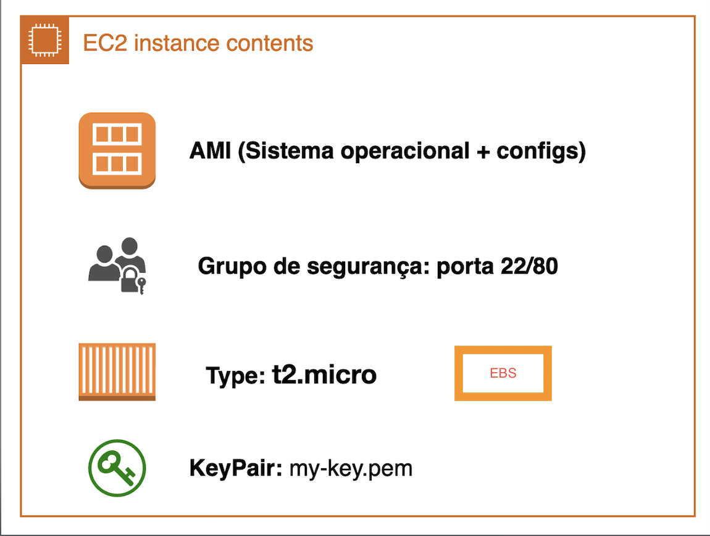

# EC2 - Elastic Compute Cloud

**EC2 (Elastic Compute Cloud)** is AWS's virtual machine service, similar to VirtualBox, but scalable and managed in the cloud.

## Main concepts:
- **AMI (Amazon Machine Image):** image used to initialize the instance (Operating systems + configs). 
    * **Image:** is a binary file that represents everything stored in the volume of a virtual machine, including the operating system and its configurations. If you want to replicate an EC2 instance, just create or use its image (AMI) — this ensures that all configurations and environment are copied to the new instance.
- **Instance type:** defines CPU/memory resources;
- **Security Group:** virtual firewall that controls traffic - you use or create one according to the need; 
- **Key Pair:** key used to access the instance via SSH.
        
  > **Warning**: it's not possible to associate a new key pair after instance creation.

And these concepts are what make an EC2 instance: VM CPU and memory + image + groups that will define inbound and outbound traffic + keypair for SSH access later.

### Costs and business examples in AWS

- Resource usage directly influences billing:  
  - **On-demand:** you pay only for the instance usage time, without long-term commitment.  
  - **Reserved:** you commit to a period (ex: 1 or 3 years) and receive significant discount.  
  - **Spot:** uses AWS idle capacity with reduced prices, but can be interrupted at any time. 