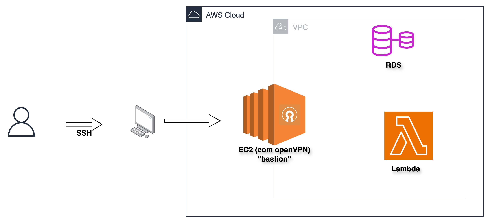
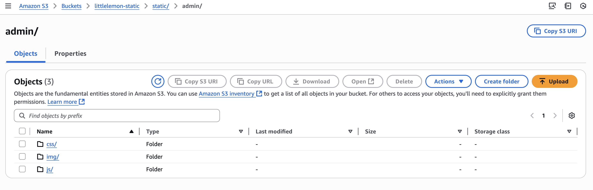
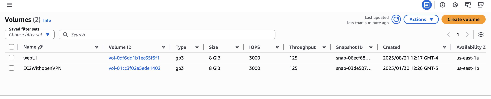

# EC2 - Elastic Compute Cloud

O **EC2(Elastic Compute Cloud)** é o serviço de máquinas virtuais da AWS, similar ao VirtualBox, mas escalável e gerenciado na nuvem.

## Conceitos principais:
- **AMI (Amazon Machine Image):** imagem usada para inicializar a instância (Sistemas operacionais + configs). 
    * **Imagem:** é um arquivo binário que representa tudo o que está armazenado no volume de uma máquina virtual, incluindo o sistema operacional e suas configurações. Se você quiser replicar uma instância EC2, basta criar ou usar a imagem (AMI) dela — através disso garante que todas as configurações e o ambiente sejam copiados na nova instância.
- **Tipo da instância:** define recursos de CPU/memória;
- **Security Group:** firewall virtual que controla tráfego - você usa ou cria um conforme a necessidade; 
- **Key Pair:** chave usada para acessar a instância via SSH.
        
  > **Atenção**: não é possível associar uma nova key pair após a criação da instância.

E esses conceitos é que fazem uma instãncia de EC2: CPU e memória da VM + imagem + groupos que vão definir o tráfego de entrada e saída + keypair para acesso via SSH depois.


## Criando instância

Pelo **Console**  ou via CLI:  

```bash
aws ec2 run-instances \
  --image-id ami-12345678 \
  --count 1 \
  --instance-type t2.micro \
  --key-name <my-key> \
  --security-groups <nome-do-SG>
````

## Acesso via SSH

- baixar o arquivo "my-key.pem" que foi criado em Keypair;
- atribui as permissões: chmod 400 my-key.pem;
- run: ssh -i my-key.pem ec2-user@ip-da-instancia


Na própria instância é possível ver as instruções para conexão:


Se tudo der certo, provavelmente você terá o seguinte:


## Caso de uso: VPC + OpenVPN

Caso você tenha criado e isolado os recursos dentro de uma VPC - Virtual Private Cloud, você pode instalar um openVPN dentro da EC2 que te permite ter conexão direta e isolada com tudo  que está dentro da VPC(RDS, Lambda, etc) sem expôr esses recursos à internet. 




### Trade-off:

Em vez de configurar tudo manualmente, tem como utilizar uma AMI pronta com OpenVPN disponível no AWS Marketplace ou optar por um serviço de VPN oferecido pela própria Amazon. A escolha depende do propósito: para empresas, esse custo faz parte do negócio; já para fins didáticos — onde o orçamento é muito limitado — vale muito a pena implementar a solução manualmente para aprender e compreender a complexidade do isolamento de rede em uma VPC.


### 4. Storages
- Amazon S3 - Simple Storage Service
  - onde guardamos objetos(imagens, backups, logs, etc);

  **É pago por:**
  - espaço utilizado(GB/mês);
  - requisições(http);
  - envio de dados para fora do ambiente da AWS;(dentro da AWS muitas tranferências são gratuitas)

  **Ciclo de vida:**
  - tem como configurar para mover os objetos automaticamente entre os tipos de armazenamento disponíveis
    Exemplo:
    - Standard: armazenanmento padrão e rápido;
    - Standard-IA(Infrequent Access): mais barato, mas vai cobrar se você acessar;
    - Glacier: arquivamento de longo prazo e pode levar entre minutos/horas para retornar o objeto;
    
    - Exemplo prático: logs que são acessados diariamente por 30 dias, depois de 90 dias são movidos pro Glacier para reduzir custo.

Esse é um exemplo de S3 onde estão todos os estáticos de um websoite em produção:




#### Amazon EBS (Elastic Block Store)
- Armazenamento em **blocos** — usado como “HD/SSD” das instâncias EC2.
- Cada volume EBS só pode ser montado em uma EC2 de cada vez (exceto em casos especiais como EBS Multi-Attach).
- Tipos de volume (otimizados para custo, IOPS, throughput).
- Persistente: mesmo que a instância EC2 seja parada, o volume continua armazenando os dados (até ser deletado).




**Resumo:**
- **S3 → objetos** (arquivos, escalável, barato, com ciclo de vida).
- **EBS → blocos** (discos virtuais para EC2, performance de I/O).

---
### 5. Custos e exemplos de negócios na AWS

- O uso dos recursos influencia diretamente na cobrança:  
  - **On-demand:** você paga apenas pelo tempo de uso da instância, sem compromisso de longo prazo.  
  - **Reservado:** você se compromete com um período (ex: 1 ou 3 anos) e recebe desconto significativo.  
  - **Spot:** utiliza capacidade ociosa da AWS com preços reduzidos, mas pode ser interrompida a qualquer momento. 

- Efeito de parar, encerrar e deletar instâncias e volumes:  
  - **Parar (stop):** a instância é desligada, mas o volume EBS permanece e continua gerando cobrança.  
  - **Encerrar (terminate):** a instância é removida e, dependendo da configuração, o volume EBS pode ser deletado ou não.  
  - **Deletar volumes:** quando removido um volume EBS, você deixa de ser cobrado por ele.


