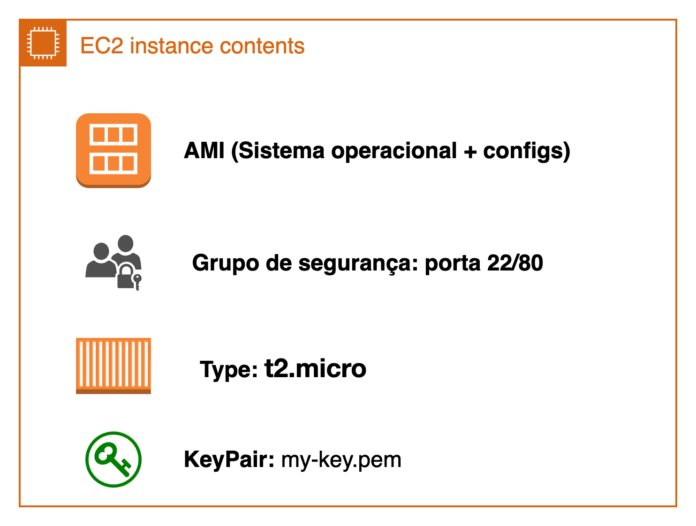

- [English](module02.md)
- [Português](module02.pt.md)

# EC2 - Elastic Compute Cloud

O **EC2(Elastic Compute Cloud)** é o serviço de máquinas virtuais da AWS, similar ao VirtualBox, mas escalável e gerenciado na nuvem.

## Conceitos principais:
- **AMI (Amazon Machine Image):** imagem usada para inicializar a instância (Sistemas operacionais + configs). 
    * **Imagem:** é um arquivo binário que representa tudo o que está armazenado no volume de uma máquina virtual, incluindo o sistema operacional e suas configurações. Se você quiser replicar uma instância EC2, basta criar ou usar a imagem (AMI) dela — através disso garante que todas as configurações e o ambiente sejam copiados na nova instância.
- **Tipo da instância:** define recursos de CPU/memória;
- **Security Group:** firewall virtual que controla tráfego - você usa ou cria um conforme a necessidade; 
- **Key Pair:** chave usada para acessar a instância via SSH.
        
  > **Atenção**: não é possível associar uma nova key pair após a criação da instância.

E esses conceitos é que fazem uma instância de EC2: CPU e memória da VM + imagem + groupos que vão definir o tráfego de entrada e saída + keypair para acesso via SSH depois.

### Custos e exemplos de negócios na AWS

- O uso dos recursos influencia diretamente na cobrança:  
  - **On-demand:** você paga apenas pelo tempo de uso da instância, sem compromisso de longo prazo.  
  - **Reservado:** você se compromete com um período (ex: 1 ou 3 anos) e recebe desconto significativo.  
  - **Spot:** utiliza capacidade ociosa da AWS com preços reduzidos, mas pode ser interrompida a qualquer momento.