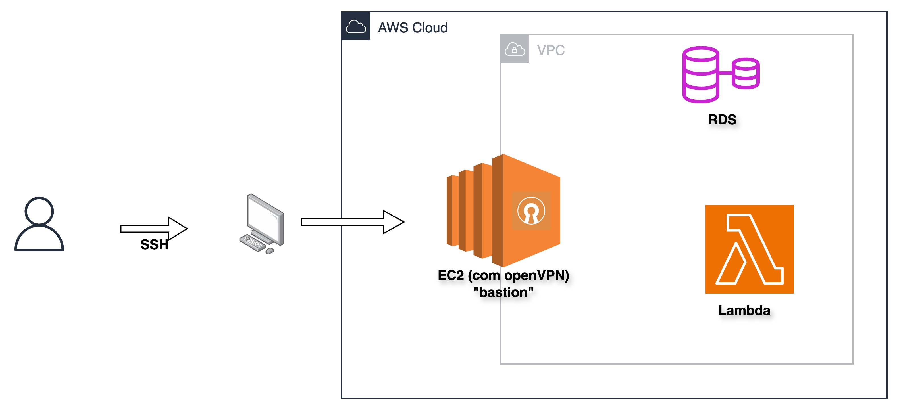

## Criando instância

Pelo **Console**  ou via CLI:  

```bash
aws ec2 run-instances \
  --image-id ami-12345678 \
  --count 1 \
  --instance-type t2.micro \
  --key-name <my-key> \
  --security-groups <nome-do-SG>
````

## Acesso via SSH

- baixar o arquivo "my-key.pem" que foi criado em Keypair;
- atribui as permissões: chmod 400 my-key.pem;
- run: ssh -i my-key.pem ec2-user@ip-da-instancia


Na própria instância é possível ver as instruções para conexão:


Se tudo der certo, provavelmente você terá o seguinte:


## Caso de uso: VPC + OpenVPN

Caso você tenha criado e isolado os recursos dentro de uma VPC - Virtual Private Cloud, você pode instalar um openVPN dentro da EC2 que te permite ter conexão direta e isolada com tudo  que está dentro da VPC(RDS, Lambda, etc) sem expôr esses recursos à internet. 




### Trade-off:

Em vez de configurar tudo manualmente, tem como utilizar uma AMI pronta com OpenVPN disponível no AWS Marketplace ou optar por um serviço de VPN oferecido pela própria Amazon. A escolha depende do propósito: para empresas, esse custo faz parte do negócio; já para fins didáticos — onde o orçamento é muito limitado — vale muito a pena implementar a solução manualmente para aprender e compreender a complexidade do isolamento de rede em uma VPC.


