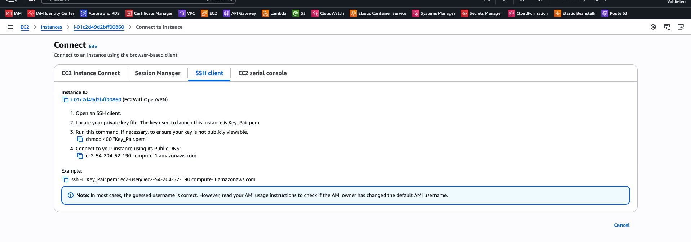

- [English](module03.md)
- [Português](module03.pt.md)

# Creating AWS resources

## Creating EC2 instance

Through **Console** or via CLI:  

```bash
aws ec2 run-instances \
  --image-id ami-12345678 \
  --count 1 \
  --instance-type t2.micro \
  --key-name <my-key> \
  --security-groups <nome-do-SG>
```

### SSH access

- download the "my-key.pem" file that was created in Keypair;
- assign permissions: chmod 400 my-key.pem;
- run: ssh -i my-key.pem ec2-user@instance-ip


In the instance itself you can see the connection instructions:




If everything goes well, you will probably have the following:


## AWS Challenge: Creating an S3 bucket and hosting a static website

In this module, we saw how to create an S3 bucket via AWS console, upload files, change the policy allowing public reading of objects.

I decided to create a bash [script](deploy_website_s3.sh) with AWS CLI and you can see the result at this endpoint: [AWSChallenge](http://dio-staticwebsite.s3-website-us-east-1.amazonaws.com/).

> **Attention:** The endpoint above uses HTTP (not HTTPS). Modern browsers may display security warnings when accessing the site, especially in incognito/private mode or on mobile devices.  
> For HTTPS, it would be necessary to configure SSL certificate - this is not the scope of the class now.

