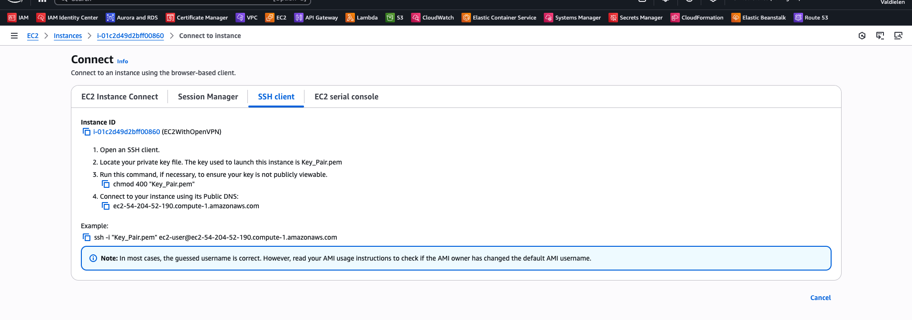

# Criando recursos na AWS

## Criando instância EC2

Pelo **Console**  ou via CLI:  

```bash
aws ec2 run-instances \
  --image-id ami-12345678 \
  --count 1 \
  --instance-type t2.micro \
  --key-name <my-key> \
  --security-groups <nome-do-SG>
```

### Acesso via SSH

- baixar o arquivo "my-key.pem" que foi criado em Keypair;
- atribui as permissões: chmod 400 my-key.pem;
- run: ssh -i my-key.pem ec2-user@ip-da-instancia


Na própria instância é possível ver as instruções para conexão:




Se tudo der certo, provavelmente você terá o seguinte:


## Desafio AWS: Criando um bucket S3 e hospedando um website estático

Nesse módulo, vimos como criar um bucket S3 via console da AWS, enviar os arquivos, alterar a política permitindo leitura pública dos objetos. 

Decidi então criar um [script](deploy_website_s3.sh) bash com AWS CLI e é possível ver o resultado neste endpoint: [DesafioAWS](http://dio-staticwebsite.s3-website-us-east-1.amazonaws.com/).

> **Atenção:** O endpoint acima utiliza HTTP (não HTTPS). Navegadores modernos podem exibir avisos de segurança ao acessar o site, especialmente em modo anônimo/incógnito ou em dispositivos móveis.  
> Para HTTPS, seria necessário configurar certificado SSL - não é o escopo da aula agora.