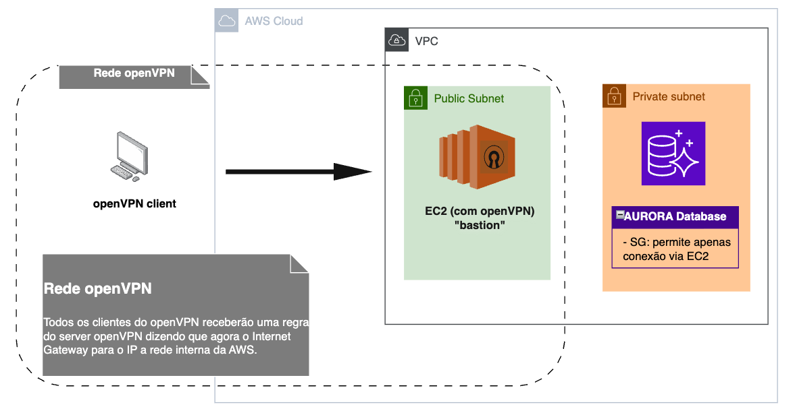

# Redes na AWS

## Virtual Private Cloud - VPC

É uma rede virtual isolada dentro da nuvem da AWS. Ao criá-la, escolhe-se uma faixa de endereços IP (CIDR block). O propósito de isolar recursos em uma VPC é garantir mais segurança, controle e organização. Se você pensar em nível de empresa, muitos serviços, setores...é interessante manter esse controle e organização entre serviços.

##  Subnets

São divisões lógicas da VPC que determinam a **localização** e qual o **nível de exposição à internet** (pública ou privada): 

***O que significa essa divisão lógica?***

*Uma subnet é um recorte da faixa de IPs (CIDR) da VPC — ou seja, você divide a VPC em blocos menores de endereços. Cada subnet existe em uma única Availability Zone e serve para agrupar recursos com o mesmo propósito ou nível de exposição. Essa divisão é lógica (não física): você escolhe quais IPs pertencem a cada subnet e associa tabelas de rota e regras que determinam se os recursos naquela subnet podem acessar a internet diretamente (via Internet Gateway) ou apenas por meio de NAT.*

- **Subnet privada**: apenas IP privados, portanto não acessíveis diretamente pela internet. Para acesso externo (ex: atualizações), configura-se um NAT Gateway ou NAT Instance(que só permite saída do tráfego).

- **Subnet pública**: Permite que recursos tenham IP público(efêmeros ou via Elastic IP) e, portanto, sejam acessíveis pela internet, desde que haja um Internet Gateway( entrada e saída de tráfego) associado e rotas configuradas.

>**Obs.:** O que define se uma subnet é pública ou privada é a presença (ou ausência) de uma rota para a internet por meio de um Internet Gateway na tabela de rotas associada a ela.

Exemplos de uso:

1. Um banco de dados (como RDS) geralmente é colocado em uma subnet privada, para que não fique acessível diretamente da internet. Mesmo que ele precise se conectar à internet (ex: para atualizações), isso pode ser feito por meio de um NAT Gateway.

2. Já um servidor web (como uma instância EC2 que roda um site) normalmente fica em uma subnet pública, com um IP público e acesso via Internet Gateway, permitindo que usuários acessem o site de fora da AWS, de qualquer lugar da internet.

## Security Groups (SG)

Um **Security Group** funciona como um **firewall virtual**, que controla o tráfego de entrada (**inbound**) e saída (**outbound**) para recursos em uma VPC, como instâncias EC2, bancos de dados, entre outros.

### Características principais:
- Associado a um recurso específico (ex: uma instância EC2);
- Permite regras baseadas em:
  - Protocolo (TCP, UDP, ICMP...)
  - Porta (ex: 22, 80, 443)
  - Origem ou destino (ex: um IP, uma faixa CIDR, outro SG)

Exemplo: permitir SSH (porta 22) apenas do seu IP local.

## Route 53: resolve o DNS público e privado para conectar internamente;

## CloudFront:
## Elastic Load Balancer: poderoso e muito utilizado.

## Extras:

### Atenção: Autorização é diferente de conectividade! 

É comum confundir **permissões de uso de recursos** com **acesso à rede**. Mas são coisas diferentes e complementares:

| Aspecto             | Segurança em rede                        | Permissões de recursos (IAM)                |
|---------------------|------------------------------------------|---------------------------------------------|
| **Ferramenta**      | Security Groups, NACLs                   | IAM Policies, Roles, Users                  |
| **Controla**        | Quem pode se conectar à rede             | O que um usuário/serviço pode fazer         |
| **Exemplo**         | "Permitir acesso à porta 3306 do RDS"    | "Permitir que a EC2 acesse o S3 via API"    |
| **Bloqueia o quê?** | Tráfego (IP/porta/protocolo)             | Ações (ex: `s3:GetObject`, `ec2:Start`)     |

### Exemplo real:
- Você pode ter uma instância EC2 com **acesso de rede liberado ao S3**, mas **sem permissão IAM** para listar objetos — logo, a chamada falha.
- Ou pode ter **permissão IAM para acessar o banco de dados RDS**, mas se o **Security Group não permitir tráfego na porta 3306**, a conexão será bloqueada.

---

> **Resumo**: Acesso à rede (Security Group) permite o tráfego até o recurso. Permissões (IAM) autorizam o que pode ser feito com o recurso.

### Exemplo de um caso de uso: VPC + OpenVPN

Se você criou e isolou os recursos dentro de uma VPC (Virtual Private Cloud), é preciso de alguma forma chegar nesses recursos para fins de desenvolvimento/ testes. Então instalar um OpenVPN em uma EC2 te permite ter conexão segura e isolada com tudo que está dentro da VPC (RDS, Lambda, etc), sem expor esses recursos à internet. Ou seja, só quem estiver conectado via VPN consegue acessar esses serviços internos - se assim o recurso aceitar via Security Group, é claro.

### Trade-off:

Ao invés de configurar tudo manualmente, tem como utilizar uma AMI pronta com OpenVPN disponível no AWS Marketplace ou optar por um serviço de VPN oferecido pela própria Amazon. A escolha depende do propósito: para empresas, esse custo faz parte do negócio; já para fins didáticos — onde o orçamento é muito limitado — vale muito a pena implementar a solução manualmente para aprender e compreender a complexidade do isolamento de rede em uma VPC.
