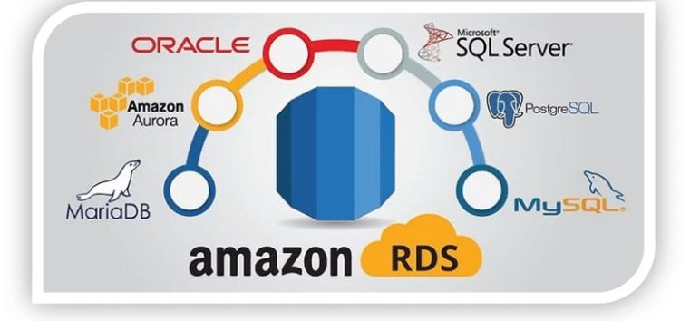

- [English](module05.md)
- [Português](module05.pt.md)

## RDS

It is the relational database service (relationship between tables) of AWS.

<p align="center">
  
</p>

- **Amazon Aurora:** Relational database compatible with MySQL and PostgreSQL, optimized by AWS. High performance and scalability; indicated when you need higher throughput than managed MySQL/Postgres. Generally higher cost, but offers advanced replication and recovery features.
- **Oracle:** Mature commercial database, advanced features (PL/SQL, partitioning, etc.). Good for enterprise legacy that already uses Oracle; high licensing cost.
- **Microsoft SQL Server:** Commercial database with strong integration to Microsoft ecosystem (.NET, SSIS, etc.). Common use in Windows corporate applications; also has licensing cost.
- **MySQL:** Open source, easy to use and widely supported. Good choice for traditional web applications; lower operational cost.
- **PostgreSQL:** Open source, focus on ACID compliance and advanced features (JSONB, extensions). Excellent for complex queries and consistency.
- **MariaDB:** MySQL fork with compatibility differences/adjustments. Alternative to MySQL depending on version/community.

Quick notes:
- Engine choice depends on compatibility, licensing cost, features and scale.
- For new projects without restrictions, PostgreSQL or MySQL are good options (Aurora if you need more performance).
- RDS manages backups, patching and high availability (Multi‑AZ), reducing operational effort.

### And why not just put a database server inside an EC2? 
RDS offers complete management (automatic backups, patching, replicas, monitoring and scalability). Otherwise, you would need to access EC2 and configure/operate everything manually — which becomes even more complex if there are multiple servers or different engines.

## DynamoDB - NoSQL

It is AWS's non-relational database service. It is schema-less: you create tables, but items (records) don't need to have the same attributes — this makes it easier to work with semi-structured data.

- Capacity modes:
  - **On-demand:** scales automatically without needing to provision throughput (good for unpredictable loads);
  - **Provisioned:** you define read/write capacity (RCU/WCU) — useful for stable workloads and cost optimization.
- **Global Tables:** managed multi-region replication for global low latency and disaster recovery.
- **TTL:** time-to-live for automatic item expiration.
- **Streams:** change flow (INSERT/UPDATE/REMOVE) for Lambda integration, event processing and custom replication.
- **Transactions:** ACID transaction support in multiple operations within DynamoDB.
- **Indexes:** GSI (Global Secondary Index) and LSI (Local Secondary Index) for flexible queries.

CLI example (insert item):

```bash
aws dynamodb put-item --table-name MinhaTabela --item '{"id":{"S":"123"},"nome":{"S":"teste"}}'
```

## Data backup and recovery

- Keep what is crucial to get the system up quickly in case of attack;
- RPO (Recovery Point Objective): how much data can be lost without critical damage to the business.  
- RTO (Recovery Time Objective): how long the system can be down.  
- Storage and tools: automatic RDS snapshots, Point-in-Time Recovery (PITR), AWS Backup for plans and retention, and S3 to store dumps/export.  
- Best practices: automate retention policies, replicate snapshots between regions for DR, and test restores regularly.


### Where to store?

- S3;
- [AWS Backup](https://docs.aws.amazon.com/aws-backup/latest/devguide/): manage and automate backup;
