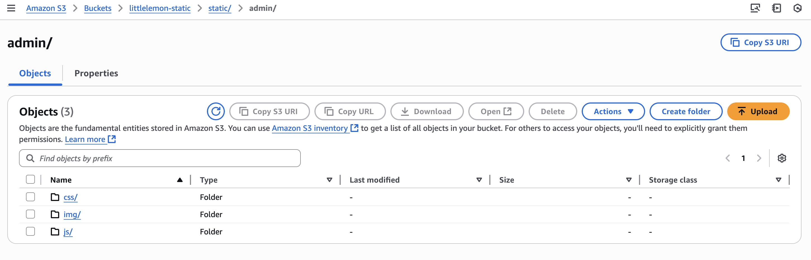
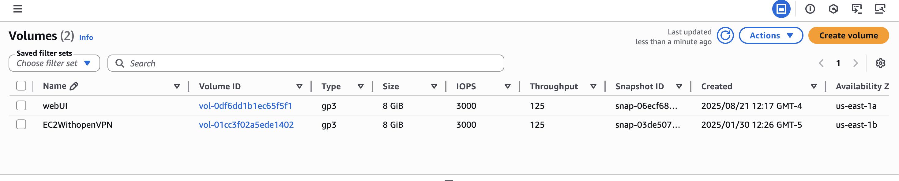
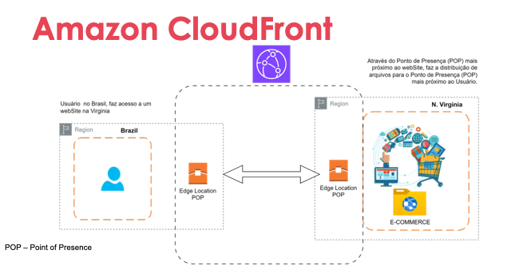

# Serviços de armazenamento e CDN

## Storages:

### S3

- Amazon S3 - Simple Storage Service
  - onde guardamos objetos(imagens, backups, logs, etc);
- Segurança: criptografia em repouso e trânsito;

  **É pago por:**
  - espaço utilizado(GB/mês);
  - requisições(http);
  - envio de dados para fora do ambiente da AWS;(dentro da AWS muitas tranferências são gratuitas)
  

  **Ciclo de vida:**
  - tem como configurar para mover os objetos automaticamente entre os tipos de armazenamento disponíveis
    Exemplo:
    - Standard: armazenanmento padrão e rápido;
    - Standard-IA(Infrequent Access): mais barato, mas vai cobrar se você acessar;
    - Glacier: arquivamento de longo prazo e pode levar entre minutos/horas para retornar o objeto;
    
    - Exemplo prático: logs que são acessados diariamente por 30 dias, depois de 90 dias são movidos pro Glacier para reduzir custo.

Esse é um exemplo de S3 onde estão todos os estáticos de um websoite em produção:

#### Glacier

O Glacier é uma opção de armazenamento de baixo custo, pensado para dados de longa retenção e baixo acesso. Principais pontos:

- Uso comum: fotos antigas, dados científicos, backups de longo prazo, registros de saúde — tudo que precisa ser guardado, mas raramente acessado.
- Retenção mínima e custo: Glacier Flexible Retrieval (antigo Glacier) tem retenção mínima recomendada de ~90 dias; Glacier Deep Archive tem retenção mínima recomendada de ~180 dias. Há cobrança por exclusão antecipada e os tempos de recuperação variam conforme a classe (de minutos a horas ou dias).
- Boas práticas: usar lifecycle rules para mover objetos automaticamente entre classes (Standard → Standard‑IA → Glacier → Deep Archive) e planejar RTO/RPO considerando os tempos de recuperação.

**Conceitos rápidos (entrada → serviço → saída/descrição)**

| Entrada | Serviço | Saída / Descrição |
|---|---|---|
| Lifecycle Policy | S3 | Regras para mover ou excluir objetos automaticamente entre Storage Classes (ex.: Standard → Glacier). |
| Cross-Region Replication | S3 | Replica objetos em outra região para recuperação de desastre e menor latência regional. |
| Cache Behavior | CloudFront | Define como o CloudFront armazena e serve conteúdo (TTL, cabeçalhos, query strings, cookies). |
| Storage Class | S3 | Define o tipo de armazenamento (Standard, Standard‑IA, One Zone‑IA, Glacier Flexible Retrieval, Deep Archive). |

### Amazon EBS (Elastic Block Store)
- Armazenamento em **blocos** — usado como “HD/SSD” das instâncias EC2.
- Cada volume EBS só pode ser montado em uma EC2 de cada vez (exceto em casos especiais como EBS Multi-Attach).
- Tipos de volume (otimizados para custo, IOPS, throughput).
- Persistente: mesmo que a instância EC2 seja parada, o volume continua armazenando os dados (até ser deletado).

**Resumo:**
- **S3 → objetos** (arquivos, escalável, barato, com ciclo de vida).
- **EBS → blocos** (discos virtuais para EC2, performance de I/O).

---
#### Custos e exemplos de negócios na AWS

- Efeito de parar, encerrar e deletar instâncias e volumes:  
  - **Parar (stop):** a instância é desligada, mas o volume EBS permanece e continua gerando cobrança.  
  - **Encerrar (terminate):** a instância é removida e, dependendo da configuração, o volume EBS pode ser deletado ou não.  
  - **Deletar volumes:** quando removido um volume EBS, você deixa de ser cobrado por ele.

## CloudFront

Para o nível de certificação *Cloud Practitioner* basta entender o que é o serviço e como ele é utilizado.

Conceitos de Edge Locations / Points of Presence (PoP) já foram vistos no [módulo 01](../Module01/module01.md#como-entender-a-estrutura-da-nuvem).

	

> Nota: o endpoint de site estático do S3 usa HTTP; para HTTPS é recomendado usar CloudFront com um certificado ACM.

## Leitura complementar

- [Amazon S3 - Developer Guide](https://docs.aws.amazon.com/AmazonS3/latest/userguide/)
- [Amazon CloudFront - Developer Guide](https://docs.aws.amazon.com/AmazonCloudFront/latest/DeveloperGuide/)

