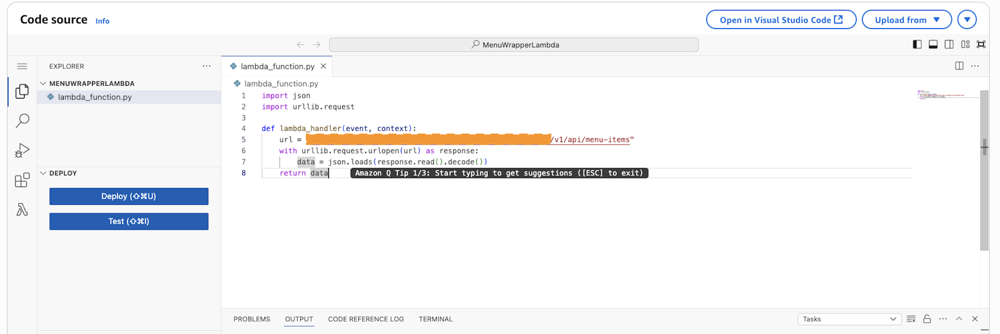

# CHALLENGE: Step Functions Demonstration

## Objective
Demonstrate the use of AWS Step Functions to orchestrate a Lambda that lists restaurant menu items (the REST API is also implemented in Lambda).

## Steps performed

### 1) Lambda Wrapper
- Function: `MenuWrapperLambda` — queries the `/menu-items` endpoint and returns the result.
- Created Lambda wrapper for orchestration with Step Functions, avoiding changes to the production Lambda that uses Mangum.

### 2) Role for Step Functions
- The trust policy allows the Step Functions service to assume the role (states.amazonaws.com).
- The current permissive policy authorizes `lambda:InvokeFunction` with Resource `"*"`.

### 3) State Machine (summary)
- Flow: `GetMenuItems` (Task — invokes `MenuWrapperLambda`) → `ProcessItems` (Map — iterates over `$.results`).
- In the Map, the current iterator executes a `Pass` per item (record in `ResultPath`) — that is, there's no additional processing for now.

### 4) Execution
- Successful execution verified in console.

## Status
- Implementation: Step Functions invokes Lambda and iterates results with Map (Pass per item).