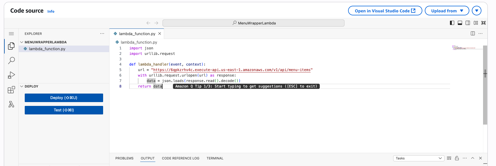
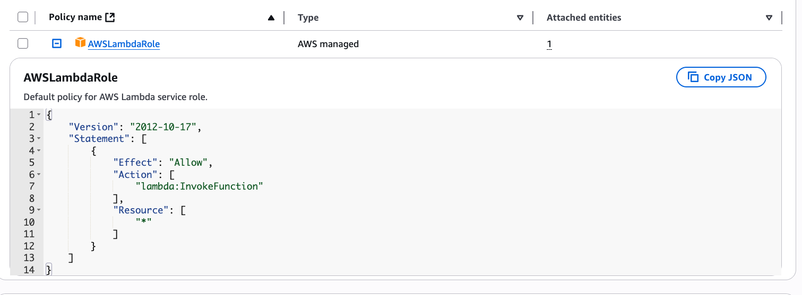
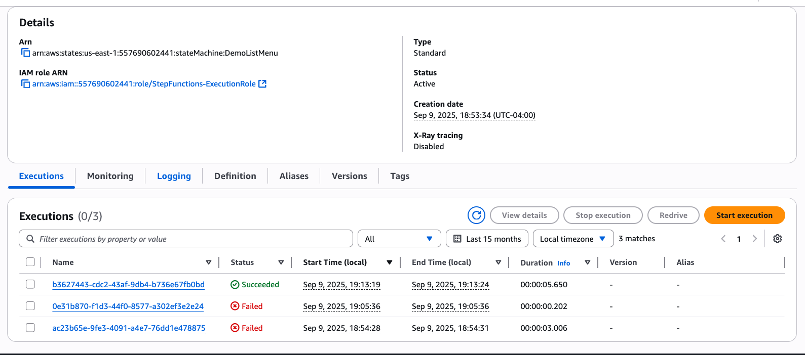
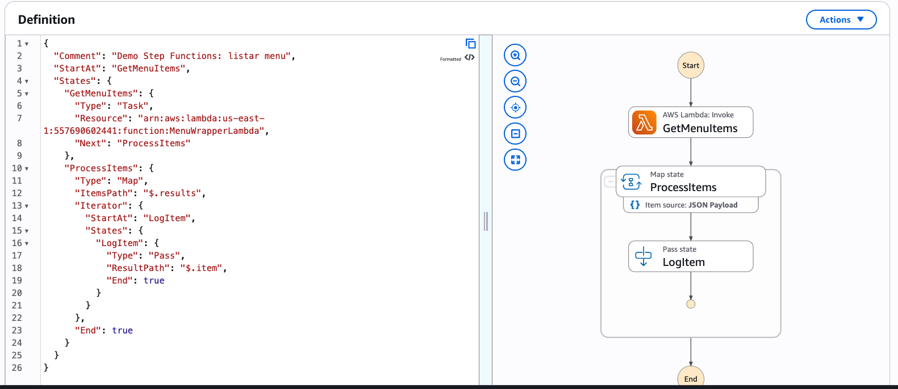
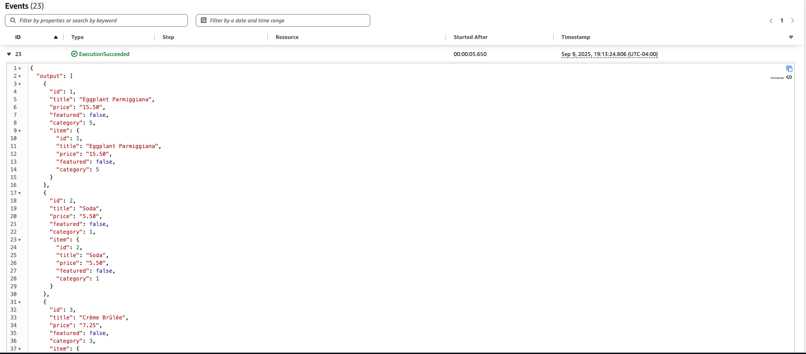

# DESAFIO: Demonstração Step Functions

## Objetivo
Demonstrar o uso do AWS Step Functions para orquestrar uma Lambda que lista itens do menu de um restaurante (a API REST também é implementada em Lambda).

## Passos realizados

### 1) Lambda Wrapper
- Função: `MenuWrapperLambda` — consulta o endpoint `/menu-items` e retorna o resultado.
- Criada Lambda wrapper para orquestração com Step Functions, evitando alterações na Lambda em produção que usa Mangum.

### 2) Role para Step Functions
- A trust policy permite que o serviço Step Functions assuma a role (states.amazonaws.com).
- A policy permissiva atual autoriza `lambda:InvokeFunction` com Resource `"*"`.

### 3) State Machine (resumo)
- Fluxo: `GetMenuItems` (Task — invoca `MenuWrapperLambda`) → `ProcessItems` (Map — itera sobre `$.results`).
- No Map, o iterator atual executa um `Pass` por item (registro em `ResultPath`) — ou seja, não há processamento adicional por enquanto.

### 4) Execução
- Execução bem‑sucedida verificada no console.

## Status
- Implementação: Step Functions invoca a Lambda e itera resultados com Map (Pass por item).