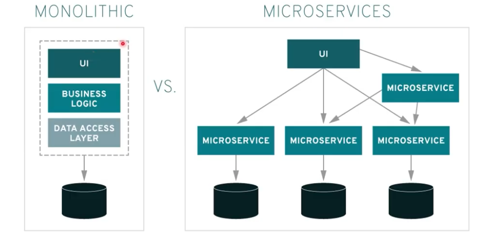
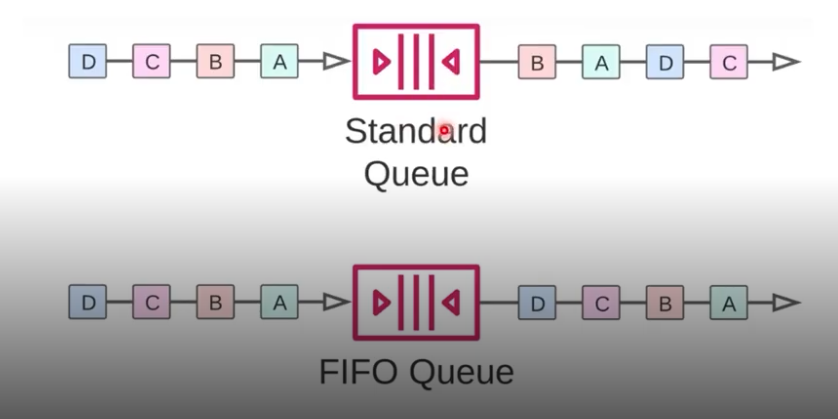

# Advanced and intermediate AWS resources


## AWS Lambda

- Serverless computing service: you only write the function code, without worrying about servers.
- Executes functions on demand, in response to events (triggers).
- Still has servers, but AWS manages them.
- Other serverless services: API Gateway, S3, DynamoDB, Cognito, SNS, SQS, Aurora Serverless.
- EC2 (virtual server, manual or managed scaling) x Lambda (stand by, automatic scaling, charged per request).

### Usage examples

- Processing files uploaded to an S3 bucket (ex: only run if it's `.csv`).
- Task automation, service integration, serverless APIs.

### Triggers

- Lambda can be triggered by events from S3, DynamoDB, API Gateway, CloudWatch, etc.
- Example: Upload of a `.csv` file to S3 → triggers Lambda function to process the file.

### Practical example (Hello World with CSV filter)

```python
def lambda_handler(event, context):
    # Example: only processes if the file is .csv
    key = event['Records'][0]['s3']['object']['key']
    if key.endswith('.csv'):
        # processes the file
        return {'status': 'CSV processed'}
    else:
        return {'status': 'Not a CSV'}
```


### Observations

- Lambda: charged by number of invocations and duration (measured in GB‑seconds); there's additional cost for provisioned concurrency.
- Maximum execution time for a Lambda function: 15 minutes.
- Allows automatic scalability.
- Cold start: depends on runtime, package size and dependencies; provisioned concurrency reduces this effect.

## ECS and EKS

>Microservices: architecture that fragments an application into small and independent services — each with single responsibility, own deployment, possibly its own storage, and communication via APIs or events; this allows isolated updates and scalability and reduces the impact of deploys on the rest of the system.



### Elastic Container Service (ECS) and Elastic Kubernetes Service (EKS)

Orchestrate containers in the cloud — analogously to EC2, which orchestrates VMs. Amazon ECS is an orchestration solution integrated with AWS; Amazon EKS is the managed offering of Kubernetes (open‑source project).

### ECS

How is orchestration done?
- automate cluster management of containers that are on EC2 or Fargate (serverless);
- scale;
- integrate with other services, security in container access;

>What are containers? In a file called Dockerfile we write the "recipe" of what the image will be: image origin (site where the image is taken from), dependencies and commands. When building the Dockerfile an image is generated; when running this image with Docker we have a container (running instance).

#### Image x Container

Unlike VMs, containers don't bring a complete operating system in the image: they share the host machine's kernel, that's why they are lightweight and start quickly.

 - Image vs container: the image is the immutable template (build); the container is the running instance of that image.
 - Isolation: containers isolate processes, networks and file systems using namespaces and cgroups; they share the host kernel (don't virtualize hardware), that's why they are lighter than VMs.
## SNS and SQS

### SNS — Simple Notification Service (asynchronous)

- Publisher/subscriber service for sending messages (push) to multiple destinations.
- Use cases: alerts/monitoring, fan‑out between microservices, mobile notifications, system integration.
- Supported endpoints: Lambda, SQS, HTTP/HTTPS, email, SMS, mobile push.
- Fan‑out: publishes a message to a topic; SNS delivers to all topic subscribers (for example, multiple SQS queues or Lambda functions).
- Message filtering: it's possible to define filter policies by attributes so subscribers receive only relevant messages.
- Delivery and durability: configurable retries, integration with DLQs via SQS; messages can be encrypted with KMS.
- Security: control by IAM and topic policies; confirmation/validation for HTTP(S) endpoints.
- Main difference from SQS: SNS is push/pub‑sub (multipoint); SQS is pull queue (individual consumption, ordering/TTL/visibility).

Standard is the most used; FIFO is recommended when message order and deduplication are crucial (ex.: financial operations).



### SQS — Simple Queue Service (queue)

It's also a message delivery system, but based on queues (pull):

- SQS = pull queue, made for organized and resilient communication between services. Producer puts the message in the queue; consumers do polling and process at their own pace.
- Supports visibility, retries, DLQ and retention until processing.

Practical example:

- Immediate notification to user: SNS → email/SMS/Lambda (push).
- Asynchronous processing by workers: producer sends to SQS → multiple workers pull and process (decoupling, fault tolerance).
- Common combination: SNS publishes an event and delivers to multiple SQS (fan‑out) so each service consumes independently and organized.

Quick observations:

- SNS tends to deliver immediately; SQS ensures the message remains persisted until consumption.
- Handle idempotency because both can deliver duplicates (use FIFO if you need order/no duplicates).
- Common combination: SNS publishes an event and delivers to multiple SQS (fan‑out) so each service consumes independently and organized.

Quick observations:

- SNS tends to deliver immediately, SQS ensures the message remains persisted until consumption.
- Handle idempotency because both can deliver duplicates (use FIFO if you need order/no duplicates).


## Step Functions

Step Functions is AWS's service for orchestrating workflows (state machines) between serverless services and microservices, offering visibility, retries and error handling in a declarative way.

### What it is

- Orchestration service based on state machines.
- Allows defining steps (Task), conditionals (Choice), parallelism (Parallel), collection mapping (Map), waits (Wait) and final states (Succeed / Fail).

### Main features

- Reusable states: Task, Choice, Parallel, Wait, Map, Succeed, Fail, Pass.
- Resilience: retries and catch per state, timeouts and integrated error handling.
- Observability: visual execution history in console and integration with CloudWatch Logs/Metrics.
- Direct integrations: Lambda, ECS, Batch, SNS, SQS, API Gateway and more (reduces glue code).
- Execution types: Standard (durable, complete history) and Express (high throughput, cost optimized for short executions).

### When to use

- Orchestrate multi‑step processes (for example: payment → inventory → notification).
- Replace scripts or ad‑hoc coordination between services.
- Data pipelines, business workflows and tasks that need retries and visibility.

### Step-by-step example

1. order.created (event)
2. validate order — Task (Lambda)
3. process payment — Task (external service or Lambda) with retries
4. confirm inventory — Parallel (check multiple centers)
5. send confirmation to customer — Task (SNS or Lambda)
6. Succeed (or Catch → compensation flow)

Tip: model small and idempotent states; use retries and catches to make the workflow tolerant to temporary failures.

### Observations

- Cost: Standard charges per state transitions; Express charges per duration/throughput — choose according to usage pattern.
- Local testing: use SAM CLI or Step Functions Local to test before deployment.
