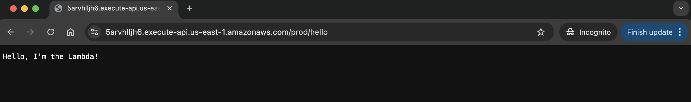

## CloudFormation Challenge

This exercise shows how to create an AWS Lambda exposed by an API Gateway using CloudFormation (YAML template). 


**1. Created the YAML template:** [lambdaViacloudFormation.YAML](./lambdaViacloudFormation.YAML);

**2. Validated the template:** 
```bash
aws cloudformation validate-template --template-body file://Module08/lambdaViacloudFormation.YAML
```

**3. Deployed via AWS cli:** 

```bash
aws cloudformation deploy \
  --template-file Module08/lambdaViacloudFormation.YAML \
  --stack-name HelloWorldStack \
  --capabilities CAPABILITY_NAMED_IAM \
    --profile <profile-name-from-aws> \
  --region us-east-1
```

**4. Successfully created and retrieved the endpoint to call the API Gateway where the lambda runs behind:**


**5. AWS CloudFormation Console:**


**6. Lambda Function**


**7. Browser:**




