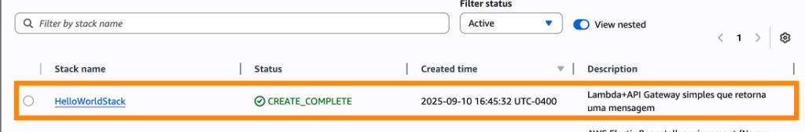
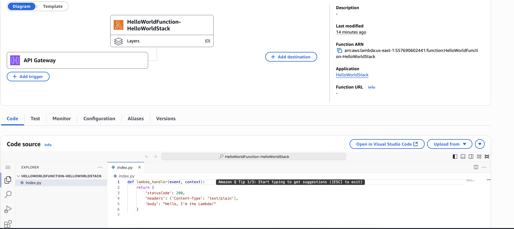

## Desafio CloudFormation

Este exercício mostra como criar uma AWS Lambda exposta por um API Gateway usando CloudFormation (template YAML). 


**1. Criado o template YAML:** [lambdaViacloudFormation.YAML](./lambdaViacloudFormation.YAML);

**2. Validado o template:** 
```bash
aws cloudformation validate-template --template-body file://Module08/lambdaViacloudFormation.YAML
```

**3. Feito deploy via AWS cli:** 

```bash
aws cloudformation deploy \
  --template-file Module08/lambdaViacloudFormation.YAML \
  --stack-name HelloWorldStack \
  --capabilities CAPABILITY_NAMED_IAM \
    --profile <profile-name-from-aws> \
  --region us-east-1
```

**4. Criado com sucess e recuperado o enpoint para chamar o API Gateway onde o lambda fica por trás:**


**5. Console CloudFormation AWS:**



**6. Lamda Function**



**7. Browser:**


