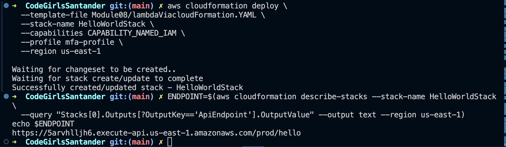
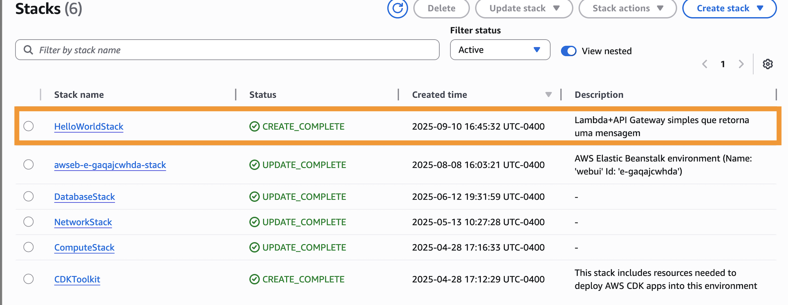
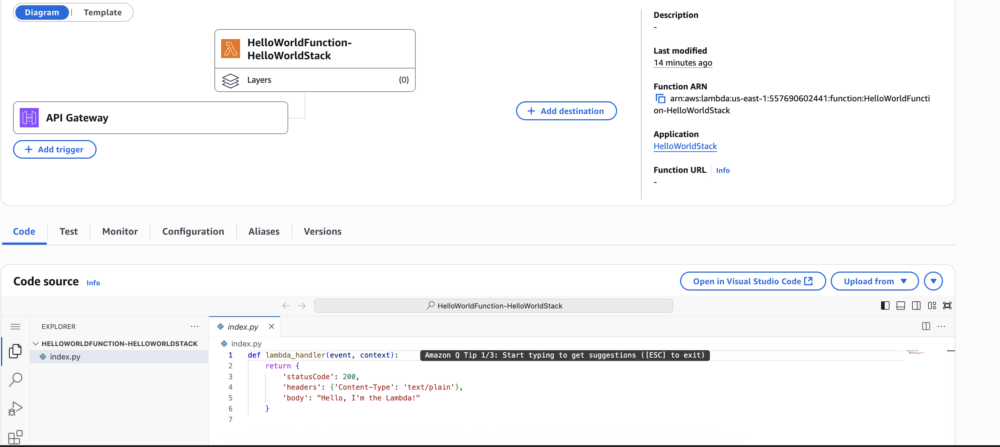
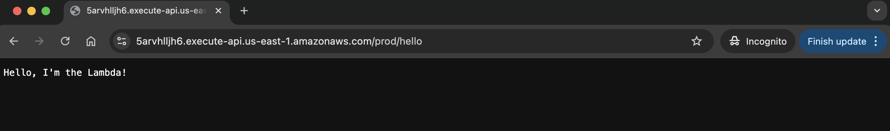

# Gerenciamento e governança AWS

## CloudWatch 

Gera métricas, logs e dashboards para monitoramento operacional de recursos e aplicações (CPU, latência, erros, etc.).
Principais usos: coleta de métricas customizadas, centralização de logs (CloudWatch Logs), criação de alarmes (SNS/ações) e dashboards operacionais.
Boas práticas: instrumentar apenas métricas necessárias, configurar retenção de logs apropriada, evitar alertas ruidosos e integrar com alarmes/auto-scaling.

## CloudTrail

Registra chamadas de API e eventos de gerenciamento e dados (opcional) — quem fez o quê, quando e de onde. Usado para auditoria, investigação de incidentes e conformidade.
Boas práticas: habilitar um trail multi-região enviando logs para um bucket S3 centralizado (com versionamento e políticas rígidas), proteger o bucket (encryption, bloqueio de deleção), habilitar CloudTrail Insights para anomalias e registrar data events críticos (S3/Lambda) apenas quando necessário devido ao custo/volume.

## CloudFormation

Automação e versionamento da criação de recursos na AWS.

### Visão geral
Este exercício mostra como criar uma AWS Lambda exposta por um API Gateway usando CloudFormation (template YAML). 


#### 1. Criado o template [YAML](./lambdaViacloudFormation.YAML);

#### 2. Validado o template: 
```bash
aws cloudformation validate-template --template-body file://Module08/lambdaViacloudFormation.YAML
```

#### 3. Feito deploy via AWS cli: 

```bash
aws cloudformation deploy \
  --template-file Module08/lambdaViacloudFormation.YAML \
  --stack-name HelloWorldStack \
  --capabilities CAPABILITY_NAMED_IAM \
    --profile <profile-name-from-aws> \
  --region us-east-1
```

#### 4. Criado com sucess e recuperado o enpoint para chamar o API Gateway onde o lambda fica por trás:



#### 5. Console CloudFormation AWS:



#### 6. Lamda Function



#### 7. Browser:




