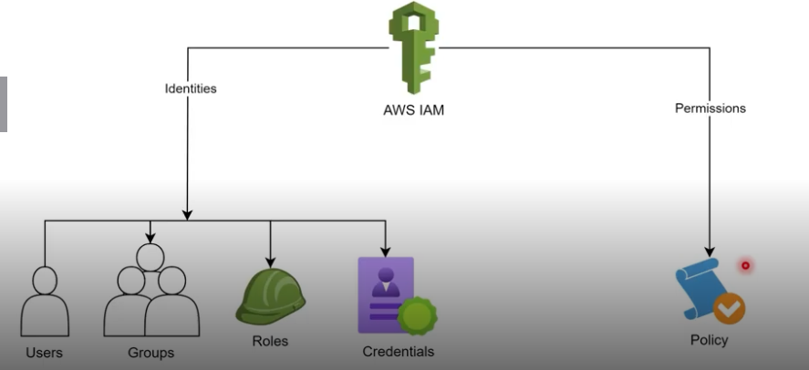

# AWS Management and Governance

## CloudWatch 

Generates metrics, logs and dashboards for operational monitoring of resources and applications (CPU, latency, errors, etc.).
Main uses: custom metrics collection, log centralization (CloudWatch Logs), alarm creation (SNS/actions) and operational dashboards.
Best practices: instrument only necessary metrics, configure appropriate log retention, avoid noisy alerts and integrate with alarms/auto-scaling.

## CloudTrail

Records API calls and management and data events (optional) — who did what, when and from where. Used for auditing, incident investigation and compliance.
Best practices: enable a multi-region trail sending logs to a centralized S3 bucket (with versioning and strict policies), protect the bucket (encryption, deletion lock), enable CloudTrail Insights for anomalies and record critical data events (S3/Lambda) only when necessary due to cost/volume.

## CloudFormation

- AWS Infra-as-Code tool to create, update and delete resources declaratively (YAML/JSON).
- Ideal for automation, standardization and infrastructure versioning in development and production environments.

## Identity and Access Management - IAM

IAM controls who can access AWS resources and with what permissions (users, groups, roles, policies).

- Main concepts: JSON policies, users, groups, roles (assume role for services/external identities), managed and inline policies.
- Best practices: apply principle of least privilege, use roles instead of long-term keys, enable MFA, rotate credentials and centralize management with AWS Organizations/SCPs when applicable.

## Policies and Roles

- Policies: are JSON documents that define permissions for actions on resources; can be managed or inline and applied to users, groups or roles.
- Roles: identities assumable by services or external users to obtain temporary permissions - the role provides tokens - (prefer roles for security and less use of static keys).

## Official links

- [IAM (overview)](https://docs.aws.amazon.com/iam/)
- [Policies and JSON policies](https://docs.aws.amazon.com/IAM/latest/UserGuide/access_policies.html)
- [Roles and AssumeRole](https://docs.aws.amazon.com/IAM/latest/UserGuide/id_roles.html)
- [IAM best practices](https://docs.aws.amazon.com/IAM/latest/UserGuide/best-practices.html)

