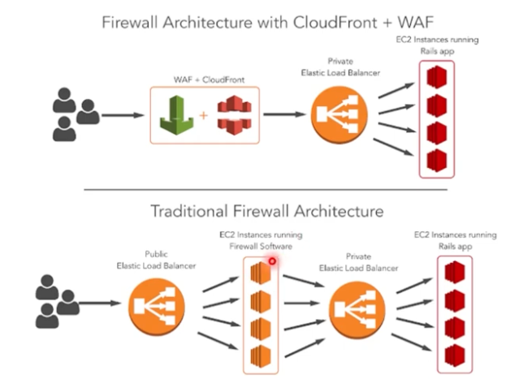

# AWS Security

## Best practices

In general, the user has to make decisions about which data should be protected and how. AWS provides the service, but business decisions are obviously the customer's responsibility.

We've already seen about shared responsibility and the difference in each service in [Module01](/Module01/module01.md#modelo-de-responsabilidade-compartilhada).

## Data encryption in AWS

- Central concept: protect data confidentiality and integrity using encryption in transit (TLS) and at rest (SSE/CMEK), with secure key management.
- Usage example: public API behind API Gateway with TLS (ACM certificate) and data stored in S3 with SSE-KMS using a managed key (CMEK) for control and rotation.

- Use keys managed by AWS KMS, apply minimal access control to keys, and route audit logs to detect misuse.

Main services/resources:
- AWS KMS — key management and rotation (concept: key authority).
  - Example: create a CMK in KMS and assign as CMEK for an S3 bucket.
- S3/EBS/RDS encryption — automatic encryption at rest (concept: stored data protection).
  - Example: enable SSE-KMS in an S3 bucket so objects are automatically encrypted.
- TLS/ACM — encryption in transit and certificate management (concept: protect communication).
  - Example: issue certificate in ACM and attach to CloudFront/ALB/API Gateway.

## AWS WAF - Web Application Firewall

- Central concept: application firewall that inspects and filters HTTP/S traffic with managed and custom rules to block layer 7 attacks (attacks that target the application layer of the OSI model, i.e.: the HTTP protocol itself and web application logic).
- Usage example: associate AWS WAF with CloudFront to block SQLi/XSS with AWS managed rules and add a rate-based rule to mitigate scraping and brute-force attacks.

## Official links

- [AWS KMS (Key Management Service)](https://docs.aws.amazon.com/kms/)
- [Encryption for Amazon S3 (SSE)](https://docs.aws.amazon.com/AmazonS3/latest/userguide/UsingEncryption.html)
- [TLS and encryption in transit](https://docs.aws.amazon.com/whitepapers/latest/security-best-practices/encryption-in-transit.html)
- [AWS WAF Developer Guide](https://docs.aws.amazon.com/waf/)
