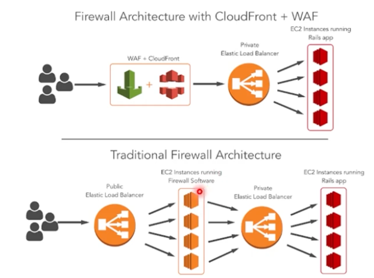

- [English](module09.md)
- [Português](module09.pt.md)

# Segurança na AWS

## Boas práticas

De forma geral, o usuário tem que tomar decisões sobre quais dados devem ser protegidos e como. A AWS oferece o serviço, mas decisões de negócios obviamente são por parte do cliente.

Já vimos sobre responsabilidade compartilhada e a diferença em cada serviço no [Module01](/Module01/module01.pt.md#modelo-de-responsabilidade-compartilhada).

## Criptografia de dados na AWS

- Conceito central: proteger confidencialidade e integridade dos dados usando criptografia em trânsito (TLS) e em repouso (SSE/CMEK), com gestão segura de chaves.
- Exemplo de uso: API pública atrás de API Gateway com TLS (certificado ACM) e dados armazenados em S3 com SSE-KMS usando uma chave gerenciada (CMEK) para controle e rotação.

- Use chaves gerenciadas pelo AWS KMS, aplique controle de acesso mínimo às chaves, e roteie logs de auditoria para detectar uso indevido.

Principais serviços/recursos:
- AWS KMS — gerenciamento e rotação de chaves (conceito: autoridade de chaves).
  - Exemplo: criar uma CMK no KMS e atribuir como CMEK para um bucket S3.
- S3/EBS/RDS encryption — criptografia automática em repouso (conceito: proteção de dados armazenados).
  - Exemplo: habilitar SSE-KMS em um bucket S3 para que objetos sejam criptografados automaticamente.
- TLS/ACM — criptografia em trânsito e gerenciamento de certificados (conceito: proteger comunicação).
  - Exemplo: emitir certificado no ACM e anexar ao CloudFront/ALB/API Gateway.

## AWS WAF - Web Applicaiton Firewall

- Conceito central: firewall de aplicação que inspeciona e filtra tráfego HTTP/S com regras gerenciadas e customizadas para bloquear ataques de camada 7(ataques que miram a camada de aplicação do modelo OSI, ou seja: o próprio protocolo HTTP e a lógica da aplicação web).
- Exemplo de uso: associar AWS WAF ao CloudFront para bloquear SQLi/XSS com regras gerenciadas da AWS e adicionar uma regra rate-based para mitigar scraping e ataques de brute-force.

## Links oficiais

- [AWS KMS (Key Management Service)](https://docs.aws.amazon.com/kms/)
- [Encryption for Amazon S3 (SSE)](https://docs.aws.amazon.com/AmazonS3/latest/userguide/UsingEncryption.html)
- [TLS and encryption in transit](https://docs.aws.amazon.com/whitepapers/latest/security-best-practices/encryption-in-transit.html)
- [AWS WAF Developer Guide](https://docs.aws.amazon.com/waf/)