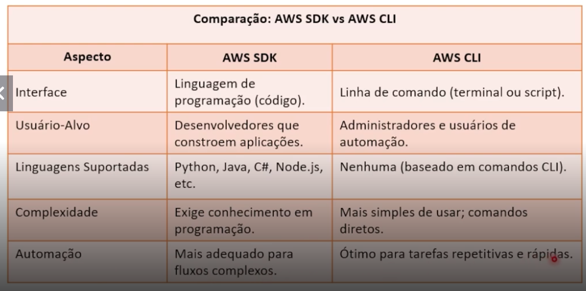

# Development and tools

## SDK and AWS CLI

### SDK
They are different libraries according to the programming language. It's one of the ways to access AWS resources by integrating with commands in code.

#### SDK usage example with Python:

**Example of using boto3 to retrieve credentials from AWS Secrets Manager during execution (lambda_handler).**

```python
(...)
def get_db_credentials(secret_name: str, region_name="us-east-1"):
    client = boto3.client('secretsmanager', region_name=region_name)
    try:
        logger.info(f"Fetching secret: {secret_name}")
        get_secret_value_response = client.get_secret_value(SecretId=secret_name)
        if 'SecretString' in get_secret_value_response:
            secret = json.loads(get_secret_value_response['SecretString'])
            logger.info(f"Secret fetched successfully: {secret_name}")
        else:
            logger.warning("SecretBinary found, but it's not supported in this case.")
            secret = json.loads(get_secret_value_response['SecretBinary'])
        return secret
    except Exception:
        logger.exception(f"Error accessing secret: {secret_name}")
        raise
```

### AWS CLI

It's another way to access AWS, but integrated with your machine. It's very useful for running scripts for example, since CloudShell doesn't allow it because it's an internal tool of the AWS console. Just update, configure the keys - which are created in the user - and this will allow running direct commands on aws.



## CloudFormation

We had already seen about CloudFormation in Module 8 and where I chose to create a stack via template for creating a lambda function that returned a message when called. [See challenge](/Module08/cloudFormationChallenge.md)

As the class drew a comparison with Terraform, I decided to use it for this Module 10 challenge. [See challenge](./project/terraformChallenge.md)


## CodeDeploy

AWS CodeDeploy is a service that automates the delivery of new versions of an application to servers, containers or functions (Lambda), in a secure and repeatable way; it takes care of copying files, running necessary steps before and after installation, and allows switching to the new version with little or no downtime, in addition to helping to go back to the previous version if something goes wrong.

- Managed service to automate application deployments on EC2/on‑premises instances, AWS Lambda and Amazon ECS.
- Supports in‑place deployment modes (updates existing instance) and blue/green (creates new environment and does cutover to reduce downtime).
- Key concepts: application, deployment group and revision (artifact to be deployed); allows rollout policies (percentage at a time, alarms, etc.).
- Lifecycle hooks: scripts or actions to execute before/after installation, validation and cleanup steps.
- Integration with CI/CD (CodePipeline, Jenkins, GitHub Actions) and monitoring to enable automatic rollback on failures.
- Benefits: reproducible, traceable deployments, with less downtime and possibility of controlled rollback.


