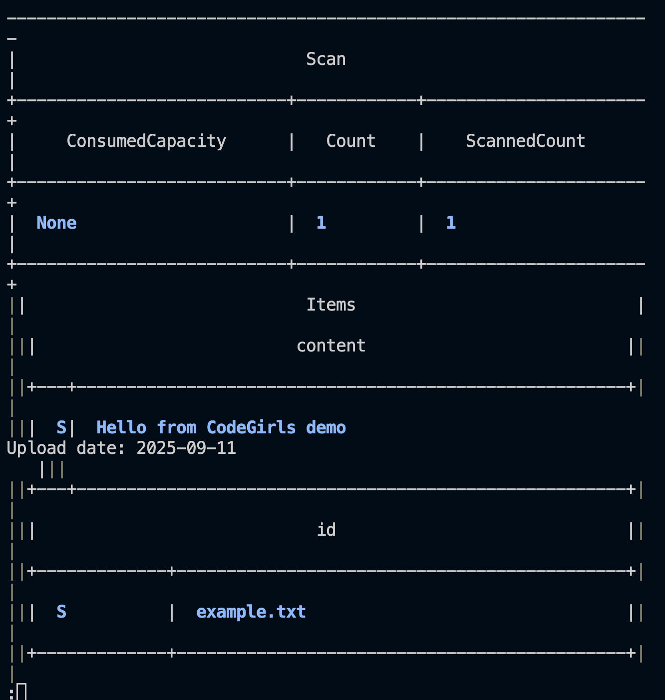
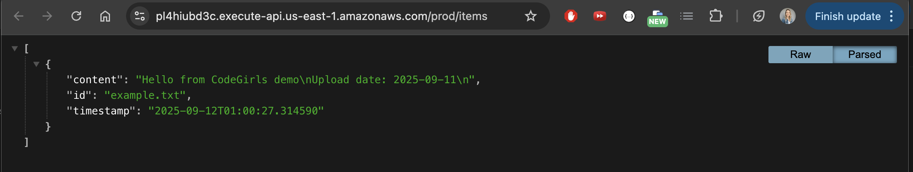

## Desafio final

Foi configurado um template YAML para o CloudFormation e implementadas duas funções Lambda: uma acionada pelo S3 para processar uploads e gravar no DynamoDB, e outra exposta via API Gateway para retornar os dados.

## O sistema é dividido em duas partes

- **Parte 1:**
	- um arquivo é enviado para o S3;
	- o S3 aciona a Lambda `s3Processor` via evento de objeto criado (PUT);
	- a Lambda `s3Processor` lê o conteúdo do objeto e persiste no DynamoDB.

- **Parte 2:**
	- a Lambda `apiGetItem`, quando chamada por um cliente, consulta o DynamoDB e retorna um JSON com os itens;
	- essa Lambda é exposta via API Gateway no endpoint GET /items.

## Arquivos adicionados em `Module11`

- `cloudformation/template.yaml` - template que cria o bucket S3 (com trigger), a tabela DynamoDB, as Lambdas, roles e API Gateway.
- `src/lambdas/s3Processor/index.py` - Lambda que processa uploads S3 e grava no DynamoDB.
- `src/lambdas/apiGetItem/index.py` - Lambda que faz scan no DynamoDB e retorna JSON.


## Como foi feito o deploy

1. As funções Lambda foram empacotadas como arquivos .zip e enviadas para um bucket de artefatos S3.
2. O template CloudFormation que referencia os zips (parâmetros `CodeBucket` e `CodePrefix`) foi implantado.
3. O stack criado provisionou: bucket de uploads (S3), tabela DynamoDB, duas Lambdas, API Gateway e as permissões mínimas.

### Comando de deploy (exemplo)

```bash
aws cloudformation deploy \
	--template-file Module11/cloudformation/template.yaml \
	--stack-name codegirls-stack \
	--profile <profile usado na aws cli> \
	--capabilities CAPABILITY_IAM
```

## Teste rápido

1. Um arquivo de exemplo pode ser enviado para o bucket criado pelo stack (substituir `<BucketName>` pelo valor do output do stack):

```bash
aws s3 cp Module11/events/example.txt s3://<BucketName>/ --profile mfa-profile
```

2. O endpoint retornado no output `ApiUrl` pode ser acessado com curl ou no navegador:

```bash
curl 'https://<api-id>.execute-api.<region>.amazonaws.com'
```

Será retornado um JSON com os itens persistidos no DynamoDB.



