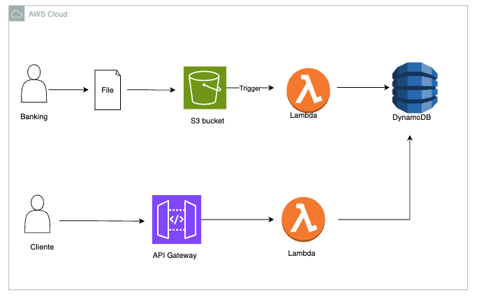

## Final Challenge

A YAML template was configured for CloudFormation and two Lambda functions were implemented: one triggered by S3 to process uploads and write to DynamoDB, and another exposed via API Gateway to return the data.




## The system is divided into two parts

- **Part 1:**
	- a file is sent to S3;
	- S3 triggers the `s3Processor` Lambda via object created event (PUT);
	- the `s3Processor` Lambda reads the object content and persists it to DynamoDB.

- **Part 2:**
	- the `apiGetItem` Lambda, when called by a client, queries DynamoDB and returns a JSON with the items;
	- this Lambda is exposed via API Gateway on the GET /items endpoint.

## Files added in `Module11`

- `cloudformation/template.yaml` - template that creates the S3 bucket (with trigger), DynamoDB table, Lambdas, roles and API Gateway.
- `src/lambdas/s3Processor/index.py` - Lambda that processes S3 uploads and writes to DynamoDB.
- `src/lambdas/apiGetItem/index.py` - Lambda that scans DynamoDB and returns JSON.


## How the deployment was done

1. The Lambda functions were packaged as .zip files and uploaded to an S3 artifacts bucket.
2. The CloudFormation template that references the zips (parameters `CodeBucket` and `CodePrefix`) was deployed.
3. The created stack provisioned: upload bucket (S3), DynamoDB table, two Lambdas, API Gateway and minimal permissions.

### Deploy command (example)

```bash
aws cloudformation deploy \
	--template-file Module11/desafio/cloudformation/template.yaml \
	--stack-name codegirls-stack \
	--profile <profile used in aws cli> \
	--capabilities CAPABILITY_IAM
```

## Quick test

1. An example file can be sent to the bucket created by the stack (replace `<BucketName>` with the value from the stack output):

```bash
aws s3 cp Module11/events/example.txt s3://<BucketName>/ --profile mfa-profile
```

2. The endpoint returned in the `ApiUrl` output can be accessed with curl or in the browser:

```bash
curl 'https://<api-id>.execute-api.<region>.amazonaws.com'
```

A JSON with the items persisted in DynamoDB will be returned.


